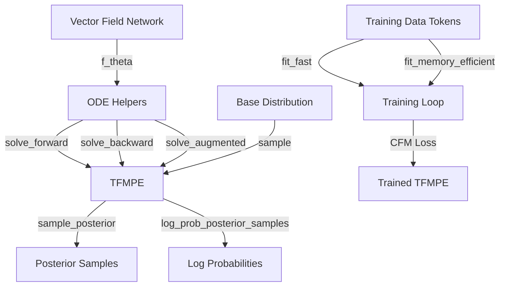

# Design Document: Tokenized Flow Matching Estimator (TFMPE)

## Overview

TFMPE is a unified estimator class combining sampling and log probability computation for flow matching-based posterior estimation. It consolidates functionality previously split between `StructuredCNF` and `SFMPE` in the legacy codebase, integrating with the new Token-based preprocessing system. The design emphasizes clarity, maintainability, and jittability of training loops.

## Steering Document Alignment

### Technical Standards (tech.md)
- Uses JAX for numerical computing with explicit type annotations via jaxtyping
- Implements vectorized operations with vmap over samples
- Follows function/typing patterns over classes/inheritance
- Maintains line length ≤ 80 characters
- No dead or duplicated code; helper functions extracted for complex implementations

### Project Structure (structure.md)
- Core estimator in `tfmpe/estimators/tfmpe.py`
- Supporting utilities in `tfmpe/estimators/ode.py` (ODE helpers)
- Training loops in `tfmpe/estimators/training.py`
- Tests mirror source structure in `test/estimators/`
- Benchmarks in `test/benchmark/`

## Code Reuse Analysis

### Existing Components to Leverage
- **Token preprocessing** (tfmpe/preprocessing/tokens.py): Container for flattened data, labels, masks, slices metadata
- **TokenGenerator** (tfmpe/preprocessing/generator.py): Memory-efficient batch generation
- **Transformer network** (tfmpe/nn/transformer/): Vector field implementation for Token inputs
- **JAX utilities**: `jax.experimental.ode.odeint`, vmap, jit for ODE solving and compilation
- **Legacy reference** (sfmpe_legacy/): FFJORD implementation, CFM loss, fit_model_no_branch patterns

### Integration Points
- **Accepts**: Token-formatted data with flattened parameters, labels, masks, independence specs
- **Produces**: Posterior samples and log probabilities in Token format
- **Training**: Works with optimizers (optax) and PRNG keys for stochastic training

## Architecture



## Components and Interfaces

### Component 1: ODE Solving Helpers (`tfmpe/estimators/ode.py`)

**Purpose:** Encapsulate ODE solving logic for forward/backward trajectories used in sampling and log probability computation.

**Key Functions:**
- `solve_forward_ode(vf_fn, x0, solver, time_span, rtol, atol) -> Array`
  - Solves forward ODE from t=0 to t=1 for sampling using Diffrax solver
  - Returns final state shape (*x0.shape)
  - Solver: diffrax solver instance (e.g., Dopri5)

- `solve_backward_ode(vf_fn, x1, solver, time_span, rtol, atol) -> Array`
  - Solves backward ODE from t=1 to t=0 for log probability using Diffrax
  - Returns final state shape (*x1.shape)
  - Solver: diffrax solver instance

- `solve_augmented_ode(vf_fn, x0, solver, time_span, rtol, atol) -> Tuple[Array, Scalar]`
  - Solves augmented ODE [x, log_det_Jacobian] using Diffrax
  - Returns (final_x, final_log_det_jacobian)
  - Uses Diffrax's native adjoint-based trace estimation

- `batch_solve_forward_ode(vf_fn, x0_batch, solver, ...) -> Array`
  - Vmapped version for batch of samples using Diffrax
  - Handles per-sample ODE solving efficiently

**Dependencies:** diffrax (ODE solver), jax.numpy, Vector field network

**Reuses:** Legacy implementation patterns from sfmpe_legacy/sfmpe/structured_cnf.py (adapted for Diffrax API)

### Component 2: TFMPE Core Class (`tfmpe/estimators/tfmpe.py`)

**Purpose:** Unified interface for sampling and log probability computation with integrated ODE solving.

**Class Structure:**
```python
class TFMPE:
    def __init__(
        self,
        vf_network: TransformerNetwork,
        base_dist_fn: Callable,  # samples from base distribution
        ode_solver_kwargs: dict,  # rtol, atol, num_steps
    ) -> None

    def sample_posterior(
        self,
        context: Token,
        num_samples: int,
        rng: PRNGKeyArray,
    ) -> Token

    def log_prob_posterior_samples(
        self,
        theta: Token,
        context: Token,
    ) -> Array  # shape (batch_size,)
```

**Key Methods:**
- `sample_posterior()`: Solves forward ODE to generate posterior samples
  - Calls base distribution sampler to get x₀
  - Solves ODE(t=0→1) with vf_network as vector field
  - Returns final state as Token with structure metadata

- `log_prob_posterior_samples()`: Computes log probs via FFJORD
  - Solves augmented backward ODE(t=1→0) with trace estimation
  - Accumulates log determinant of Jacobian
  - Returns shape (batch_size,) log probability array

- `_vector_field_wrapper()`: Adapts vector field for ODE solving
  - Handles time parameter and vector field network interface
  - Manages Token ↔ flattened array conversions

**Dependencies:** ODE helpers, Token structures, base distribution, vector field network

**Reuses:** FFJORD algorithm from sfmpe_legacy, flow matching concepts

### Component 3: Training Loops (`tfmpe/estimators/training.py`)

**Purpose:** Implement fast and memory-efficient training pipelines with CFM loss.

#### fit_fast() - Speed-Optimized Training
**Signature:**
```python
def fit_fast(
    tfmpe: TFMPE,
    train_tokens: Token,
    val_tokens: Token,
    optimizer: optax.GradientTransformation,
    n_iter: int,
    rng: PRNGKeyArray,
) -> Tuple[TFMPE, Array]  # returns (trained_tfmpe, losses)
```

**Implementation:**
- Reshape tokens to (n_batches, batch_size, ...)
- Use nnx.scan over iterations for JIT compilation
- Jittable loss function with vmap over batch samples
- Weighted loss aggregation: loss × (batch_size / total_size)
- Returns losses shape (n_iter, 2) with [train_loss, val_loss]

**Key Properties:**
- **Fully jittable** with `jax.jit()` via nnx.scan
- No Python control flow in inner loop
- Pre-computed batch indices for determinism

#### fit_memory_efficient() - Memory-Optimized Training
**Signature:**
```python
def fit_memory_efficient(
    tfmpe: TFMPE,
    token_generator: TokenGenerator,
    val_tokens: Token,
    optimizer: optax.GradientTransformation,
    n_iter: int,
    rng: PRNGKeyArray,
    early_stopping_patience: int = 10,
) -> Tuple[TFMPE, Array]  # returns (trained_tfmpe, losses)
```

**Implementation:**
- Python loop iterates over token_generator batches
- Gradient steps computed per batch
- Early stopping with validation monitoring
- Same CFM loss as fit_fast

**Key Properties:**
- Avoids materializing full dataset
- Supports variable batch sizes from generator
- Flexible early stopping criteria

#### CFM Loss Function
**Signature:**
```python
def cfm_loss(
    tfmpe: TFMPE,
    theta: Array,  # flattened parameters
    context: Array,  # observations/context
    theta_time: Array,  # uniform sample [0, 1]
    rng: PRNGKeyArray,
) -> Scalar
```

**Implementation:**
1. Linear interpolation: σ_t = 1 - (1 - σ_min) × t
2. Interpolated sample: θ_t = θ × σ_t + ε (ε ~ N(0,1))
3. Target velocity: u_t = (θ - (1 - σ_min) × θ_t) / (1 - σ_t)
4. Vector field prediction: v = vf_network(θ_t, context, t)
5. MSE loss: mean((v - u_t)²), weighted by padding masks

**Dependencies:** Vector field network, masking utilities

**Reuses:** CFM loss from sfmpe_legacy/sfmpe/sfmpe.py

## Data Models

### Token Structure (Used Throughout)
```python
Token:
  data: Array  # shape (n_samples, d_flat) - flattened parameters
  labels: Array  # shape (n_samples, d_flat) - token labels for attention
  masks: Optional[Array]  # shape (n_samples, d_flat) - padding masks
  slices: SliceInfo  # metadata for unflattening
  independence: Independence  # attention masking configuration
```

### ODE State
```python
# Forward: Array shape (d_flat,)
# Backward: Array shape (d_flat,)
# Augmented: Tuple[Array, Scalar] = (x, log_det_jacobian)
```

## Error Handling

### Error Scenarios

1. **Invalid ODE solver parameters**
   - **Handling:** Validate rtol, atol > 0 in __init__
   - **User Impact:** Raises ValueError at TFMPE initialization

2. **Vector field network output shape mismatch**
   - **Handling:** Assert vf_network output matches input shape
   - **User Impact:** Raises AssertionError during first forward pass

3. **NaN/Inf in ODE solving**
   - **Handling:** odeint raises NumericalError, caught in training
   - **User Impact:** Training iteration fails; user adjusts ODE parameters or learning rate

4. **Mismatched Token shapes in training**
   - **Handling:** Validate train/val tokens have same structure
   - **User Impact:** Raises AssertionError at fit_fast() start

5. **Generator exhaustion (fit_memory_efficient)**
   - **Handling:** Break loop when generator yields no more batches
   - **User Impact:** Training completes naturally

## Testing Strategy

### Unit Testing (test/estimators/test_ode.py)
- **Doubling continuous flow**: f(θ) = log(2)·θ transforms N(0,1) → N(0,4)
- **Forward ODE**: Verify trajectory matches analytical solutions
- **Backward ODE**: Verify log_det_jacobian accumulation
- **Batch operations**: Verify vmap correctness across sample batches

### Integration Testing (test/estimators/test_tfmpe.py)
- **Sampling consistency**: Verify samples from posterior distribution
- **Log probability accuracy**: Check rtol=0.1, atol=0.5 stochastic tolerance
- **Token compatibility**: Verify Token I/O with structured data
- **End-to-end flow**: Train on synthetic data, verify sampling produces reasonable posterior

### End-to-End Testing (test/estimators/test_e2e.py)
- **Hierarchical Gaussian linear model**:
  - σ ~ HalfNormal(1), μ ~ Normal(0, 1), y ~ Normal(μ, σ)
  - Train TFMPE to learn posterior p(σ, μ | y)
  - Verify loss decreases during training
  - Verify posterior samples have reasonable statistics
  - Verify log probabilities are finite and reasonable

### Performance Benchmarks (test/benchmark/test_estimator_benchmark.py)
- **Speed benchmark**: Training iteration time on standard hierarchical dataset
- **Scale benchmark**: Training iteration time on large dataset (100k+ samples)
- **Sampling speed**: Batch sampling throughput for different batch sizes
- **Log prob speed**: Log probability computation throughput
