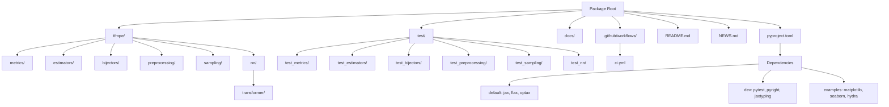

# Design Document

## Overview

The repository initialization design establishes a modern Python scientific computing package infrastructure for TFMPE. It creates an empty but complete project structure following JAX/Flax conventions, with comprehensive development tooling, testing infrastructure, and automation pipelines. The design leverages proven patterns from the legacy implementation while modernizing for current best practices.

## Steering Document Alignment

### Technical Standards (tech.md)

- **Language**: Python 3.10+ with pip-based dependency management
- **Core Stack**: JAX for numerical computing, Flax for neural networks, Optax for optimization
- **Development Tools**: pytest for testing, pyright for static analysis, mkdocs for documentation
- **Quality Requirements**: All non-slow tests pass, no pyright issues, benchmarking support
- **Virtual Environment**: Uses existing `env/` directory at project root

### Project Structure (structure.md)

- **Package Organization**: tfmpe/ with metrics/, estimators/, bijectors/, preprocessing/, sampling/, nn/transformer/ modules
- **Testing Structure**: test/ directory mirroring source structure with pytest markers (slow, speed, scale)
- **Import Patterns**: Follows standard ordering (built-in, external, internal, types, constants)
- **Configuration**: Root-level pyproject.toml, .gitignore, mkdocs.yml files
- **Documentation**: README.md and NEWS.md at project root

## Code Reuse Analysis

### Existing Components to Leverage

- **Legacy Structure**: sfmpe_legacy/ provides proven module organization and dependency patterns
- **Legacy Documentation**: sfmpe_legacy/README.md provides template for TFMPE documentation structure
- **Steering Documents**: .claude/steering/ files guide technical decisions and project conventions
- **Virtual Environment**: Existing env/ directory for development dependencies

### Integration Points

- **Legacy Reference**: New structure mirrors sfmpe_legacy organization while using modern Python packaging
- **Development Workflow**: Integrates with existing CLAUDE.md development commands (pytest, pyright)
- **Git Repository**: Builds on existing .git structure with enhanced CI/CD automation

## Architecture

The design follows a layered scientific computing package architecture:



## Components and Interfaces

### Package Structure Component
- **Purpose:** Establish modular package organization ready for implementation
- **Interfaces:** Empty __init__.py files providing importable package structure
- **Dependencies:** Python packaging standards, setuptools
- **Reuses:** Structure conventions from structure.md and legacy organization patterns

### Documentation Component
- **Purpose:** Provide clear project introduction and development guidance
- **Interfaces:** README.md for user documentation, NEWS.md for changelog
- **Dependencies:** Markdown formatting, mkdocs for enhanced documentation
- **Reuses:** Documentation patterns from legacy README.md and structure.md conventions

### Dependency Management Component
- **Purpose:** Organize dependencies into logical groups for different use cases
- **Interfaces:** pyproject.toml with [project.optional-dependencies] sections
- **Dependencies:** Core scientific computing stack (JAX, Flax, Optax)
- **Reuses:** Dependency list from tech.md and patterns from legacy pyproject.toml

### Testing Infrastructure Component
- **Purpose:** Provide comprehensive testing framework with performance benchmarking
- **Interfaces:** pytest configuration with custom markers and fixtures
- **Dependencies:** pytest, pytest-benchmark for performance testing
- **Reuses:** Testing patterns from legacy conftest.py and CLAUDE.md test commands

### Code Quality Component
- **Purpose:** Enforce type safety and code standards
- **Interfaces:** pyright configuration, import pattern enforcement
- **Dependencies:** pyright for static analysis, jaxtyping for JAX arrays
- **Reuses:** Quality standards from tech.md requirements

### CI/CD Component
- **Purpose:** Automate testing, quality checks, and documentation builds
- **Interfaces:** GitHub Actions workflows
- **Dependencies:** GitHub Actions, Python matrix testing
- **Reuses:** CI patterns from legacy .github/workflows/ with enhancements

## Data Models

### Project Configuration
```python
# pyproject.toml structure
[project]
name = "tfmpe"
description = "Tokenised Flow Matching for Posterior Estimation"
requires-python = ">=3.10"
dependencies = ["jax", "flax", "optax", ...]

[project.optional-dependencies]
dev = ["pytest", "pyright", "jaxtyping", "pytest-benchmark"]
examples = ["matplotlib", "seaborn", "hydra-core"]
```

### Documentation Structure
```markdown
# README.md template structure
- Project overview and TFMPE explanation
- Installation instructions for different dependency groups
- Development setup and contribution guidelines
- Usage examples placeholder

# NEWS.md template structure
- Changelog format with version headers
- Categories: Added, Changed, Fixed, Removed
- Release date tracking
```

### Package Structure
```python
# Directory tree structure
tfmpe/
├── __init__.py          # Main package entry point
├── metrics/             # Empty module for future metrics
│   └── __init__.py
├── estimators/          # Empty module for future estimators
│   └── __init__.py
├── bijectors/           # Empty module for future bijectors
│   └── __init__.py
├── preprocessing/       # Empty module for future preprocessing
│   └── __init__.py
├── sampling/            # Empty module for future sampling
│   └── __init__.py
└── nn/                  # Empty module for future neural networks
    ├── __init__.py
    └── transformer/     # Empty submodule for transformers
        └── __init__.py
```

## Error Handling

### Error Scenarios
1. **Missing Dependencies:** Installation fails due to missing system dependencies
   - **Handling:** Clear error messages in setup, comprehensive installation docs in README.md
   - **User Impact:** Users see actionable error messages with resolution steps

2. **Import Failures:** Package imports fail due to missing __init__.py files
   - **Handling:** Ensure all directories have proper __init__.py files
   - **User Impact:** Clean import errors with module path information

3. **Documentation Build Issues:** mkdocs fails to build documentation
   - **Handling:** Basic mkdocs.yml configuration with placeholder content
   - **User Impact:** Documentation builds successfully with empty structure

## Testing Strategy

### Unit Testing
- Empty test structure ready for future implementations
- conftest.py with placeholder fixtures for scientific computing patterns
- Test discovery working for all module directories

### Integration Testing
- CI pipeline testing package installation across dependency groups
- Cross-platform testing (Ubuntu/macOS/Windows compatibility)
- Documentation build testing in CI pipeline

### Performance Testing
- pytest-benchmark infrastructure ready for future performance tests
- Marker system supporting "speed" and "scale" benchmarking categories