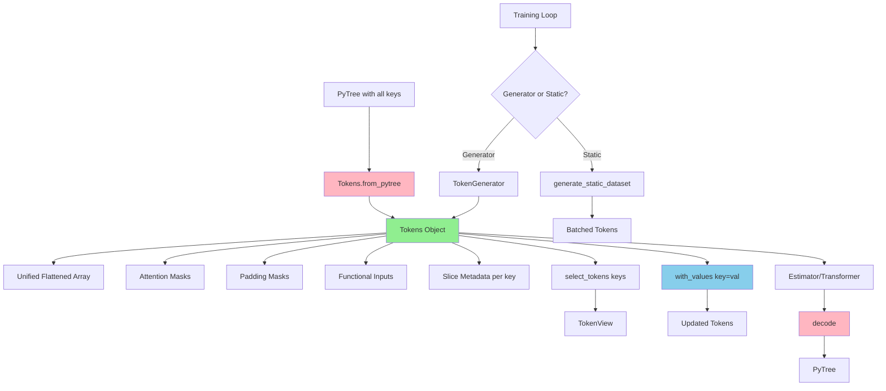

# Design Document: Parameter Processing Infrastructure

## Overview

This design specifies a unified `Tokens` interface for TFMPE that consolidates structured parameter handling, masking, functional inputs, and metadata into a single coherent system. Unlike the legacy approach which:
- Passes 9+ separate arguments to functions
- Duplicates storage for `theta` and `y` (which are processed symmetrically)
- Requires manual reconstruction of slice metadata across function calls

The new design provides a single `Tokens` object that:
- Stores all tokens in unified arrays (not separate theta/y)
- Allows dynamic slicing into subsets via key specifications
- Supports value overrides and key swapping without recreating the entire structure
- Enables on-the-fly restructuring as seen in `bottom_up.py`

The system supports both memory-efficient data generators (for non-jitted training) and static dataset generation (for jitted training), with all components designed for JAX JIT compatibility.

## Steering Document Alignment

### Technical Standards (tech.md)

- **JAX/Flax ecosystem**: All operations use `jax.numpy`, support `vmap`, and are JIT-compatible
- **Type annotations**: Uses `jaxtyping.Array` for JAX arrays, standard Python types for shapes/metadata
- **Testing with pytest**: Parametrized tests with custom markers (`@pytest.mark.slow` for >5s tests)
- **80-character line limit**: All code respects this constraint with multi-line imports

### Project Structure (structure.md)

- **Location**: `tfmpe/preprocessing/` for implementation, `test/test_preprocessing/` for tests
- **Import order**: Built-in ’ External (jax, flax) ’ Internal ’ Types ’ Constants
- **Documentation**: Numpy-style docstrings for all public functions
- **Test structure**: Mirror source file organization, descriptive test names

## Code Reuse Analysis

### Existing Components to Leverage

- **`sfmpe_legacy/util/dataloader.py`**: Core algorithms for flattening, mask generation, and reconstruction
  - `flatten_blocks()`: Flatten PyTree blocks with padding
  - `build_self_attention_mask()`, `build_cross_attention_mask()`: Independence-based mask generation
  - `build_padding_mask()`: Variable-length sequence masking
  - `decode_theta()`: Reconstruct PyTree from flat array
  - `_flatten_index()`: Functional input flattening

- **Pytest infrastructure**: Existing `test/conftest.py` and marker system

### Integration Points

- **`tfmpe/estimators/`**: Estimators will receive `Tokens` objects instead of multiple arguments
- **`tfmpe/nn/transformer/`**: Transformer attention layers will consume masks from `Tokens`
- **`tfmpe/sampling/`**: Sampling algorithms will use `Tokens` for batch generation

### Departures from Legacy

The legacy code passes many separate objects and duplicates storage:
```python
# Legacy approach - separate theta/y + 9+ arguments
data = {
    'theta': {...},  # Stored separately
    'y': {...}       # Stored separately
}
flat_data, slices = flatten_structured(data, independence=...)
# Returns: {'data': {'theta': ..., 'y': ...}, 'labels': {'theta': ..., 'y': ...}, ...}
cnf.sample(context, context_label, context_index, context_mask,
           theta_shape, theta_label, theta_index, theta_mask, cross_mask)
```

The new design unifies storage and enables dynamic slicing:
```python
# New approach - unified storage + dynamic slicing
tokens = Tokens.from_pytree(data, independence=...)
# Internally: single flattened array with all tokens

# Dynamic slicing based on keys
target_tokens = tokens.select_tokens(['mu', 'theta'])
cond_tokens = tokens.select_tokens(['obs'])

# Or specify at call time
samples = cnf.sample(tokens, target_keys=['mu', 'theta'])
```

## Architecture



## Components and Interfaces

### Component 1: Tokens (Core Unified Interface)

- **Purpose:** Single container for all token data with dynamic slicing capabilities
- **Interfaces:**
  ```python
  @dataclass
  class Tokens:
      # Unified flattened data
      data: Array  # shape: (batch, n_total_tokens, max_batch_size)

      # Labels (integer type indicators per token)
      labels: Array  # shape: (batch, n_total_tokens)

      # Masks
      self_attention_mask: Array   # shape: (n_total_tokens, n_total_tokens)
      padding_mask: Array          # shape: (batch, n_total_tokens)

      # Functional inputs (optional)
      functional_inputs: Optional[Array]  # shape: (batch, n_total_tokens, max_batch_size)

      # Metadata for slicing and reconstruction
      slices: dict[str, dict]  # {key_name: {offset, event_shape, batch_shape}}
      label_map: dict[str, int]  # {key_name: label_id}

      # Ordering of keys (for consistent indexing)
      key_order: list[str]

      @classmethod
      def from_pytree(
          cls,
          data: PyTree,
          independence: dict,
          functional_inputs: Optional[PyTree] = None,
          sample_ndims: int = 1,
          batch_ndims: Optional[PyTree] = None,
      ) -> 'Tokens':
          """
          Create Tokens from structured PyTree.

          All keys in data are flattened into a single token array.
          """

      def select_tokens(self, keys: list[str]) -> 'TokenView':
          """
          Create view selecting specified keys.

          Returns a TokenView that provides slices, labels, and masks
          for only the selected keys.
          """

      def cross_attention_mask(
          self,
          query_keys: list[str],
          key_keys: list[str]
      ) -> Array:
          """
          Generate cross-attention mask between query and key tokens.

          Uses independence specification to zero out prohibited connections.
          """

      def with_values(self, **key_values: dict[str, Array]) -> 'Tokens':
          """
          Create new Tokens with specified keys replaced by new values.

          Example:
              new_tokens = tokens.with_values(mu=new_mu_samples)

          The new values are re-flattened and inserted at the correct
          offsets in the unified array.
          """

      def decode(self, flat_array: Optional[Array] = None) -> PyTree:
          """
          Reconstruct PyTree from flat array.

          If flat_array is None, uses self.data.
          """

      def decode_keys(
          self,
          flat_array: Array,
          keys: list[str]
      ) -> PyTree:
          """
          Reconstruct only specified keys from flat array.

          Useful when target_keys is a subset of all keys.
          """
  ```

- **Dependencies:** `jax.numpy`, `jaxtyping`, `dataclasses`
- **Reuses:** Legacy flattening/mask functions (adapted)

### Component 2: TokenView (Efficient Subset View)

- **Purpose:** Lightweight view into Tokens for key subsets
- **Interfaces:**
  ```python
  @dataclass
  class TokenView:
      """
      View into Tokens selecting a subset of keys.

      Does not copy data, only stores indices/slices.
      """
      parent: Tokens
      selected_keys: list[str]

      # Cached computed properties
      _token_indices: Optional[Array] = None
      _data_slice: Optional[Array] = None

      @property
      def data(self) -> Array:
          """Get data for selected keys."""

      @property
      def labels(self) -> Array:
          """Get labels for selected keys."""

      @property
      def self_attention_mask(self) -> Array:
          """Get self-attention mask for selected keys."""

      @property
      def padding_mask(self) -> Array:
          """Get padding mask for selected keys."""

      @property
      def functional_inputs(self) -> Optional[Array]:
          """Get functional inputs for selected keys."""

      @property
      def slices(self) -> dict[str, dict]:
          """Get slice metadata for selected keys (re-indexed to 0)."""
  ```

- **Dependencies:** `Tokens`, `jax.numpy`
- **Reuses:** N/A (new component for efficiency)

### Component 3: TokenGenerator (Memory-Efficient Iterator)

- **Purpose:** Generate `Tokens` batches on-demand without pre-allocation
- **Interfaces:**
  ```python
  class TokenGenerator:
      def __init__(
          self,
          prior_fn: Callable,
          simulator_fn: Callable,
          functional_input_fn: Optional[Callable],
          independence: dict,
          n_samples: int,
          batch_size: int,
          seed: int,
      ):
          """
          Initialize generator with sampling functions.
          """

      def __iter__(self) -> Iterator[Tokens]:
          """Yield batches of Tokens."""

      def __len__(self) -> int:
          """Number of batches."""
  ```

- **Dependencies:** `Tokens`, `jax.random`
- **Reuses:** N/A (new component)

### Component 4: Static Dataset Generation

- **Purpose:** Pre-generate full dataset for JIT-compiled training loops
- **Interfaces:**
  ```python
  def generate_static_dataset(
      key: Array,
      prior_fn: Callable,
      simulator_fn: Callable,
      functional_input_fn: Optional[Callable],
      independence: dict,
      n_samples: int,
  ) -> Tokens:
      """
      Generate complete dataset as single Tokens object.

      All array shapes are static for JIT compatibility.
      """
  ```

- **Dependencies:** `Tokens`, `jax.random`, `jax.vmap`
- **Reuses:** `Tokens.from_pytree`

### Component 5: Flattening and Reconstruction Utilities

- **Purpose:** Low-level operations for converting between PyTrees and flat arrays
- **Interfaces:**
  ```python
  def flatten_pytree(
      data: PyTree,
      sample_ndims: int,
      batch_ndims: dict,
      pad_value: float,
      max_batch_size: int,
  ) -> tuple[Array, dict]:
      """
      Flatten all keys in PyTree to single 2D array with metadata.

      Returns:
          flat_array: shape (batch, total_tokens, max_batch_size)
          slices: {key: {offset, event_shape, batch_shape}}
      """

  def decode_pytree(
      flat_array: Array,
      slices: dict,
      sample_shape: tuple,
      keys: Optional[list[str]] = None,
  ) -> PyTree:
      """
      Reconstruct PyTree from flat array.

      If keys specified, only reconstruct those keys.
      """

  def update_flat_array(
      flat_array: Array,
      slices: dict,
      key: str,
      new_value: Array,
  ) -> Array:
      """
      Update flat array with new value for specified key.

      Used by Tokens.with_values().
      """
  ```

- **Dependencies:** `jax.numpy`
- **Reuses:** Legacy `flatten_blocks`, `decode_theta` (adapted to unified storage)

### Component 6: Mask Generation Utilities

- **Purpose:** Create attention and padding masks from independence specifications
- **Interfaces:**
  ```python
  def build_self_attention_mask(
      slices: dict,
      independence: dict,
      selected_keys: Optional[list[str]] = None,
  ) -> Array:
      """
      Create self-attention mask from independence spec.

      If selected_keys provided, creates mask only for those keys.
      """

  def build_cross_attention_mask(
      query_slices: dict,
      key_slices: dict,
      independence: dict,
  ) -> Array:
      """
      Create cross-attention mask between query and key tokens.
      """

  def build_padding_mask(
      slices: dict,
      event_shapes: PyTree,
      selected_keys: Optional[list[str]] = None,
  ) -> Array:
      """
      Create padding mask for variable-length sequences.

      If selected_keys provided, creates mask only for those keys.
      """
  ```

- **Dependencies:** `jax.numpy`, `numpy` (for mask construction)
- **Reuses:** Legacy mask functions (adapted to unified storage)

### Component 7: Functional Input Processing

- **Purpose:** Handle flattening and padding of functional inputs
- **Interfaces:**
  ```python
  def flatten_functional_inputs(
      functional_inputs: PyTree,
      slices: dict,
      sample_ndims: int,
      pad_value: float = -1e8,
  ) -> Array:
      """
      Flatten functional inputs aligned with token slices.

      Returns:
          Array with shape matching flattened data
      """
  ```

- **Dependencies:** `jax.numpy`
- **Reuses:** Legacy `_flatten_index` (adapted)

## Data Models

### Tokens (Primary Interface)

```python
@dataclass
class Tokens:
    """
    Unified container for structured token data.

    Stores all parameters and observations in a single flattened array,
    enabling dynamic slicing into subsets via key selection.

    Attributes
    ----------
    data : Array
        All flattened tokens, shape (batch, n_total_tokens, max_batch_size)
    labels : Array
        Integer labels per token, shape (batch, n_total_tokens)
    self_attention_mask : Array
        Self-attention mask for all tokens,
        shape (n_total_tokens, n_total_tokens)
    padding_mask : Array
        Padding mask, shape (batch, n_total_tokens)
    functional_inputs : Optional[Array]
        Functional inputs for tokens,
        shape (batch, n_total_tokens, max_batch_size)
    slices : dict[str, dict]
        Metadata per key: {name: {offset, event_shape, batch_shape}}
    label_map : dict[str, int]
        Mapping from key names to label integers
    key_order : list[str]
        Ordered list of keys (matches slice order)
    """
```

### TokenView (Subset View)

```python
@dataclass
class TokenView:
    """
    Efficient view into Tokens selecting a subset of keys.

    Does not copy data, only computes indices for selected keys.
    Properties are lazily evaluated and cached.

    Attributes
    ----------
    parent : Tokens
        Parent Tokens object
    selected_keys : list[str]
        Keys to include in this view
    """
```

### Slice Metadata Structure

```python
# slices format (unified for all keys):
{
    "key_name": {
        "offset": int,           # Starting index in flattened array
        "event_shape": tuple,    # Original event dimensions
        "batch_shape": tuple,    # Original batch dimensions
    },
    ...
}
```

### Independence Specification Format

```python
# independence dict format (from legacy):
{
    "local": ["key1", "key2"],  # Self-independent keys
    "cross": [("key1", "key2"), ("key3", "key4")],  # Cross-independent pairs
    "cross_local": [
        ("key1", "key2", (0, 0)),  # Pairwise along dimensions 0,0
        ("key3", "key4", None),     # Pairwise diagonal (sizes must match)
    ],
}
```

## Use Cases from bottom_up.py

### Use Case 1: Key Swapping (Lines 116-119)

```python
# Legacy approach:
y_data = {
    'theta': y_samples,    # Swap: observations go to theta slot
    'y': theta_samples     # Swap: parameters go to y slot
}
y_flat, _ = flatten_structured(y_data, independence=...)

# New approach:
all_data = {'theta': theta_samples, 'obs': y_samples}
tokens = Tokens.from_pytree(all_data, independence=...)

# Later, dynamically specify which is target vs conditioning:
samples = estimator.sample(
    tokens,
    target_keys=['obs'],        # Train to predict obs
    conditioning_keys=['theta']  # Given theta
)
```

### Use Case 2: Selective Key Extraction (Lines 162-166)

```python
# Legacy approach:
global_samples = {
    k: v for k, v in theta_samples.items() if k in global_names
}

# New approach:
tokens = Tokens.from_pytree(theta_samples, independence=...)
global_tokens = tokens.select_tokens(global_names)
# Returns TokenView with only global keys, no data copying
```

### Use Case 3: Value Override (Lines 189-192)

```python
# Legacy approach:
theta = global_samples | local_samples
theta = {key: theta[key] for key in y_data['y'].keys()}

# New approach:
tokens = tokens.with_values(
    mu=new_mu_value,
    sigma=new_sigma_value
)
# Returns new Tokens with updated values re-flattened at correct offsets
```

### Use Case 4: Dynamic Restructuring (Lines 248-256)

```python
# Legacy approach: manually reconstruct 'theta' and 'y' blocks
data = {
    'theta': y_sim['y'],
    'y': y_vec
}
flat_data, data_slices = flatten_structured(
    data,
    independence=independence
)

# New approach: create once, slice dynamically
all_data = {**y_sim['y'], 'obs': y_vec['obs']}
tokens = Tokens.from_pytree(all_data, independence=...)

# Specify target/conditioning at usage time
estimator.fit(
    tokens,
    target_keys=list(y_sim['y'].keys()),
    conditioning_keys=['obs']
)
```

## Error Handling

### Error Scenarios

1. **Dimension Mismatch in Independence Spec**
   - **Handling:** Validate shapes in `build_cross_attention_mask`, raise `ValueError` with clear message
   - **User Impact:** "Cannot apply cross_local independence: dimension 0 of 'theta' has size 10 but dimension 0 of 'obs' has size 5"

2. **Invalid Functional Input Shapes**
   - **Handling:** Check that functional inputs match token structure in `flatten_functional_inputs`
   - **User Impact:** "Functional input 'obs' has shape (10,) but expected to match token shape (10, 5)"

3. **Key Not Found in Tokens**
   - **Handling:** Validate keys in `select_tokens`, `with_values`
   - **User Impact:** "Key 'sigma' not found. Available keys: ['mu', 'theta', 'obs']"

4. **Padding Exceeds 2x Threshold**
   - **Handling:** Warn if `max_batch_size / min_batch_size > 2` in `flatten_pytree`
   - **User Impact:** "Warning: Batch size padding ratio is 3.5x, consider restructuring data"

5. **JIT Tracer Leaks**
   - **Handling:** All operations use static shapes; if tracer detected, raise with debugging info
   - **User Impact:** "Dynamic shape detected in JIT context. Ensure all shapes are statically known."

6. **Invalid Slice Reconstruction**
   - **Handling:** Validate that sum of slice sizes matches flat array size in `decode_pytree`
   - **User Impact:** "Slice metadata specifies 100 tokens but flat array has 95 tokens"

## Testing Strategy

### Unit Testing

**Test Structure:** `test/test_preprocessing/test_tokens.py`

1. **Tokens Creation**
   - Test `from_pytree` with hierarchical structures from legacy examples
   - Parametrize over 2-level (hierarchical_gaussian), 3-level structures
   - Verify all fields populated correctly

2. **Flattening/Reconstruction Round-Trip**
   - Create PyTree ’ flatten ’ reconstruct ’ verify equality
   - Test with different batch dimensions
   - Test with padding (variable batch sizes)

3. **Dynamic Key Selection**
   - Test `select_tokens` with different key combinations
   - Verify TokenView doesn't copy data (check memory addresses)
   - Test accessing all TokenView properties

4. **Value Override**
   - Test `with_values` with single and multiple keys
   - Verify flat array updated at correct offsets
   - Test round-trip: override ’ decode ’ verify new values

5. **Cross-Attention Mask**
   - Test `cross_attention_mask` with different query/key combinations
   - Verify shapes and patterns match legacy implementation

6. **Mask Generation**
   - Test self-attention masks with `local` independence
   - Test cross-attention masks with `cross` independence
   - Test cross-local masks with functional input mapping
   - Verify mask shapes and non-zero patterns

7. **Functional Input Processing**
   - Test flattening with matching shapes
   - Test padding with sentinel values
   - Test `None` functional inputs

8. **Data Generation Strategies**
   - Test `TokenGenerator` yields correct batch count
   - Test `generate_static_dataset` creates proper shapes
   - Verify equivalence between generator and static for same seed

### Integration Testing

**Test Structure:** `test/test_preprocessing/test_integration.py`

1. **Legacy Example Compatibility**
   - Load independence specs from `hierarchical_gaussian.py`
   - Create `Tokens` and verify masks match legacy output
   - Repeat for `hierarchical_brownian.py` and `seir.py`

2. **bottom_up.py Use Cases**
   - Implement all 4 use cases from design
   - Verify equivalence with legacy behavior
   - Test key swapping, selective extraction, value override, restructuring

3. **JIT Compilation**
   - JIT-compile function that processes `Tokens`
   - Verify no tracer leaks or dynamic shape errors
   - Test with vmap over batch dimension

4. **End-to-End with Estimator Mock**
   - Create simple mock estimator that consumes `Tokens`
   - Test training loop with generator approach
   - Test training loop with static dataset approach

### Test Markers and Performance

- Default tests: <5 seconds, core functionality
- `@pytest.mark.slow`: Large-scale tests (e.g., seir example with 100+ sites)
- Parametrization: Use `@pytest.mark.parametrize` for structure variations

### Test Fixtures

```python
# conftest.py additions
@pytest.fixture
def hierarchical_gaussian_spec():
    """Independence spec from hierarchical_gaussian.py."""
    return {
        'local': ['obs', 'theta'],
        'cross': [('mu', 'obs'), ('obs', 'mu')],
        'cross_local': [('theta', 'obs', (0, 0))]
    }

@pytest.fixture
def simple_pytree():
    """Simple 2-level hierarchical structure."""
    return {
        'mu': jnp.ones((1, 1, 1)),
        'theta': jnp.ones((1, 5, 1)),
        'obs': jnp.ones((1, 5, 3))
    }

@pytest.fixture
def bottom_up_swap_case():
    """Data for testing key swapping use case."""
    return {
        'theta_samples': {...},
        'y_samples': {...},
        'expected_target_keys': ['obs'],
        'expected_cond_keys': ['theta']
    }
```
