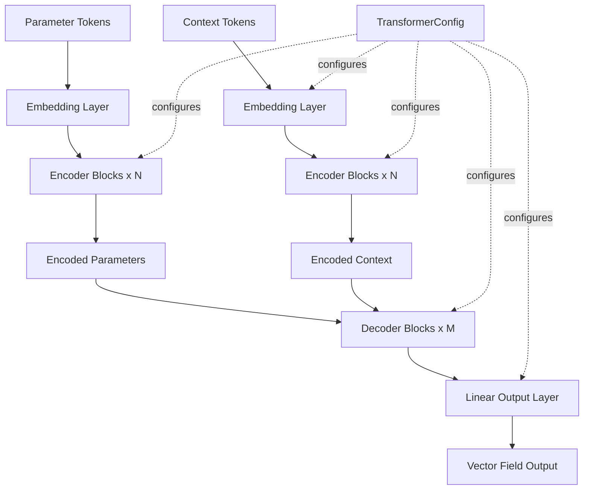

# Design Document

## Overview

The Transformer architecture provides the neural network backbone for TFMPE, implementing an encoder-decoder transformer that processes structured parameter data via the `Tokens` interface. Unlike the legacy implementation which required manual management of flattened arrays, labels, indices, and masks, this design leverages the unified `Tokens` API for cleaner integration with the preprocessing pipeline.

The architecture consists of modular components (embedding, encoder blocks, decoder blocks) that are individually testable and configurable via a dataclass-based configuration system.

## Steering Document Alignment

### Technical Standards (tech.md)

- **JAX/Flax**: All components use `flax.nnx` modules for neural network layers
- **Type annotations**: Functions use `jaxtyping.Array` for array types
- **Testing**: pytest for unit tests, pytest-benchmark for speed benchmarks, pytest-memray for memory profiling
- **Documentation**: Numpy-style docstrings throughout
- **Static analysis**: Code passes pyright type checking

### Project Structure (structure.md)

- **Location**: `tfmpe/nn/transformer/` following the documented structure
- **Testing**: Tests in `test/test_nn/test_transformer/` with component-level organization
- **Benchmarks**: Performance tests in `test/benchmark/` with `@pytest.mark.speed` and `@pytest.mark.scale` markers
- **Imports**: Follows standard order (built-in, external, internal, types, constants)

## Code Reuse Analysis

### Existing Components to Leverage

- **`tfmpe.preprocessing.Tokens`**: Core data structure for unified parameter handling
  - Provides `data`, `labels`, `self_attention_mask`, `functional_inputs`
  - Eliminates need for manual array management
  - Supports `select_tokens()` for creating context/parameter views
  - Supports `cross_attention_mask()` for encoder-decoder attention

- **`tfmpe.preprocessing.TokenView`**: Efficient subset views into Tokens
  - Used to separate context and parameter tokens
  - Provides re-indexed slices and masks for subsets
  - Lazy evaluation with cached properties

- **Legacy transformer components** (`sfmpe_legacy/sfmpe/nn/transformer/`):
  - Reference for GaussianFourierEmbedding implementation
  - Reference for encoder/decoder block architecture
  - Reference for MLP feedforward structure
  - **NOTE**: Adapt patterns, don't copy violations of project standards

### Integration Points

- **Tokens API**: Primary input interface
  - Transformer receives context and parameter `Tokens` objects
  - Extracts data, labels, masks via properties
  - Uses `cross_attention_mask()` for decoder attention

- **Test patterns**: Follow existing test structure
  - Shape tests similar to `test/test_preprocessing/test_tokens_basic.py`
  - Use `@pytest.mark.parametrize` for input variations
  - Mark slow tests with `@pytest.mark.slow`

## Architecture



## Components and Interfaces

### TransformerConfig (Dataclass)

- **Purpose:** Configuration container for transformer architecture parameters
- **Module:** `tfmpe/nn/transformer/config.py`
- **Attributes:**
  ```python
  @dataclass
  class TransformerConfig:
      latent_dim: int          # Hidden dimension size
      n_encoder: int           # Number of encoder layers
      n_decoder: int           # Number of decoder layers
      n_heads: int             # Number of attention heads
      n_ff: int                # Number of feedforward layers per block
      label_dim: int           # Label embedding dimension
      index_out_dim: int       # Index embedding output dimension
      dropout: float           # Dropout rate
      activation: Callable     # Activation function (e.g., nnx.relu)
  ```
- **Dependencies:** None (pure dataclass)
- **Reuses:** Standard Python dataclass pattern

### Embedding

- **Purpose:** Embed token values, labels, indices, and time into latent space
- **Module:** `tfmpe/nn/transformer/embedding.py`
- **Interfaces:**
  - `__init__(config, value_dim, n_labels, index_dim, rngs)`
  - `__call__(values, labels, indices, time, functional_inputs=None) -> Array`
- **Input shapes:**
  - `values`: `(*sample_shape, n_tokens, value_dim)`
  - `labels`: `(*sample_shape, n_tokens)` (int32)
  - `indices`: `(*sample_shape, n_tokens, index_dim)` or None
  - `time`: `(*sample_shape,)` scalar or `(*sample_shape, 1)` array
  - `functional_inputs`: `(*sample_shape, n_tokens, value_dim)` or None
- **Output shape:** `(*sample_shape, n_tokens, latent_dim)`
- **Dependencies:**
  - `flax.nnx.Embed` for label embeddings
  - `flax.nnx.Linear` for final projection
  - `GaussianFourierEmbedding` for index encoding
- **Reuses:** Legacy `GaussianFourierEmbedding` pattern

### GaussianFourierEmbedding

- **Purpose:** Fourier feature encoding for continuous indices
- **Module:** `tfmpe/nn/transformer/embedding.py`
- **Interfaces:**
  - `__init__(in_dim, out_dim, rngs)`
  - `__call__(inputs) -> Array`
- **Input shape:** `(..., in_dim)`
- **Output shape:** `(..., out_dim)`
- **Dependencies:** JAX for sin/cos operations
- **Reuses:** Direct adaptation from legacy implementation

### EncoderBlock

- **Purpose:** Self-attention transformer block
- **Module:** `tfmpe/nn/transformer/encoder.py`
- **Interfaces:**
  - `__init__(config, rngs)`
  - `__call__(x, mask=None) -> Array`
- **Input shape:** `(*sample_shape, n_tokens, latent_dim)`
- **Output shape:** `(*sample_shape, n_tokens, latent_dim)`
- **Architecture:**
  - Multi-head self-attention
  - Layer normalization
  - MLP feedforward (n_ff layers)
  - Residual connections
- **Dependencies:**
  - `flax.nnx.MultiHeadAttention`
  - `flax.nnx.LayerNorm`
  - `MLP` module
- **Reuses:** Legacy encoder block pattern with updated API

### DecoderBlock

- **Purpose:** Cross-attention transformer block
- **Module:** `tfmpe/nn/transformer/encoder.py`
- **Interfaces:**
  - `__init__(config, rngs)`
  - `__call__(x, context, mask=None) -> Array`
- **Input shapes:**
  - `x`: `(*sample_shape, n_query_tokens, latent_dim)`
  - `context`: `(*sample_shape, n_key_tokens, latent_dim)`
- **Output shape:** `(*sample_shape, n_query_tokens, latent_dim)`
- **Architecture:**
  - Multi-head cross-attention (query=x, key/value=context)
  - Layer normalization
  - MLP feedforward
  - Residual connections
- **Dependencies:**
  - `flax.nnx.MultiHeadAttention`
  - `flax.nnx.LayerNorm`
  - `MLP` module
- **Reuses:** Legacy decoder block pattern

### MLP

- **Purpose:** Multi-layer feedforward network with dropout
- **Module:** `tfmpe/nn/transformer/encoder.py`
- **Interfaces:**
  - `__init__(config, rngs)`
  - `__call__(x) -> Array`
- **Input shape:** `(..., latent_dim)`
- **Output shape:** `(..., latent_dim)`
- **Architecture:** n_ff sequential layers with dropout and activation
- **Dependencies:**
  - `flax.nnx.Linear`
  - `flax.nnx.Dropout`
- **Reuses:** Legacy MLP/FFLayer pattern with nnx.scan for layer iteration

### Transformer

- **Purpose:** Main transformer model coordinating all components
- **Module:** `tfmpe/nn/transformer/transformer.py`
- **Interfaces:**
  - `__init__(config, value_dim, n_labels, index_dim, rngs)`
  - `__call__(context_tokens, param_tokens, time) -> Array`
  - `encode(tokens, time) -> Array`
  - `decode(tokens, encoded_context, time) -> Array`
- **Input:**
  - `context_tokens`: Tokens object for context
  - `param_tokens`: Tokens object for parameters
  - `time`: `(*sample_shape,)` time scalar for flow matching
- **Output shape:** `(*sample_shape, n_param_tokens, value_dim)`
- **Architecture:**
  1. Embed context tokens
  2. Encode context through encoder blocks with self-attention
  3. Embed parameter tokens
  4. Encode parameters through encoder blocks with self-attention
  5. Decode parameters with cross-attention to context through decoder blocks
  6. Linear projection to value_dim
- **Dependencies:** All above components
- **Reuses:** Legacy transformer architecture adapted for Tokens API

## Data Models

### TransformerConfig

```python
@dataclass
class TransformerConfig:
    latent_dim: int = 128
    n_encoder: int = 4
    n_decoder: int = 4
    n_heads: int = 8
    n_ff: int = 2
    label_dim: int = 32
    index_out_dim: int = 64
    dropout: float = 0.1
    activation: Callable = nnx.relu
```

### Tokens (from preprocessing)

Already implemented in `tfmpe.preprocessing.Tokens`. Key attributes used:

- `data: Array` - Token values
- `labels: Array` - Token type labels
- `self_attention_mask: Array` - Self-attention mask
- `functional_inputs: Optional[Array]` - Functional inputs
- `sample_shape: Tuple[int, ...]` - Sample dimensions

## Error Handling

### Error Scenarios

1. **Shape mismatch between context and parameter Tokens**
   - **Handling:** Validate that both Tokens have same `sample_shape` in `__call__`
   - **User Impact:** Clear ValueError with expected vs actual shapes

2. **Time array incompatible with sample shape**
   - **Handling:** Broadcast time to `(*sample_shape, 1)` if scalar, validate shape otherwise
   - **User Impact:** ValueError indicating time shape requirements

3. **Missing functional_inputs when expected**
   - **Handling:** Embedding layer treats None functional_inputs as zeros or omits concatenation
   - **User Impact:** Transparent - model works with or without functional inputs

4. **Configuration with invalid dimensions**
   - **Handling:** Validate `latent_dim % n_heads == 0` in TransformerConfig post-init
   - **User Impact:** ValueError on configuration creation, not model initialization

5. **Benchmark threshold exceeded**
   - **Handling:** pytest assertion failure with measured vs threshold values
   - **User Impact:** Test failure with clear performance regression message

## Testing Strategy

### Unit Testing

**Location:** `test/test_nn/test_transformer/`

**Component tests:**
- `test_config.py`: Validate TransformerConfig dataclass
  - Default values
  - Invalid configurations (e.g., latent_dim not divisible by n_heads)

- `test_embedding.py`: Test Embedding layer
  - Output shape with/without indices
  - Output shape with/without functional_inputs
  - Time broadcasting
  - Value range checks

- `test_encoder.py`: Test EncoderBlock, DecoderBlock, MLP
  - Output shapes preserved
  - Mask application
  - Gradients flow correctly

- `test_transformer.py`: Test full Transformer
  - End-to-end forward pass shape
  - Encode method shape
  - Decode method shape
  - Integration with Tokens objects
  - Backward pass (gradient computation)

**Test patterns:**
- Use `@pytest.mark.parametrize` for varying dimensions
- Create fixture for sample Tokens objects
- Verify shapes at each layer
- Test with and without sample dimensions

### Benchmark Testing

**Location:** `test/benchmark/test_transformer_speed.py`, `test/benchmark/test_transformer_memory.py`

**Speed benchmarks (pytest-benchmark):**
- Forward pass timing
- Backward pass timing (jax.grad)
- Parameterized by: `n_tokens`, `latent_dim`, `n_encoder`, `n_decoder`
- Markers: `@pytest.mark.speed` (standard configs), `@pytest.mark.scale` (large configs)
- Asserts: execution time < threshold

**Memory benchmarks (pytest-memray):**
- Forward pass peak memory
- Backward pass peak memory
- Same parameterization as speed benchmarks
- Markers: `@pytest.mark.speed`, `@pytest.mark.scale`
- Asserts: peak memory < threshold (MB)

### Integration Testing

**Test full pipeline:**
1. Create sample PyTree
2. Convert to Tokens with independence structure
3. Split into context/parameter views
4. Run through transformer
5. Verify output shape matches parameter tokens
6. Compute gradient w.r.t. parameters
7. Verify gradient shape matches parameter shape

This validates the complete TFMPE workflow from structured data to gradient computation.
